# Gradient-Boosting-Regression

Overview:

This is a regression task (used to predict continuous values), and Gradient Boosting Regression will be used. The dataset consists of 1000 rows, 35 columns/features, and shows the relationship between air quality, weather conditions, and public health. The aim is to compute feature importance to determine which factors have the greatest impact on public health risk.

Data Cleaning/Feature Engineering:

First, let's examine the columns/features of the dataset. The first column is named datetimeEpoch. This is the time at which data is collected for a given data point, expressed as the number of seconds since January 1, 1970. Computers can perform mathematical operations more easily on date-time values expressed this way than in the mm/dd/yyyy format.

The column datetimeEpoch contains valuable information such as the season, day, time of day, etc., when the measurements for a particular data point took place.

Let's extract the season from datetimeEpoch in Python and print the results:

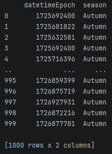

All values of datetimeEpoch occur within the same season; therefore, datetimeEpoch does not provide meaningful seasonal data (if a feature has a constant value, there is no pattern for a model to learn from).

Next, let's extract the time of day (morning, day, evening, night) from datetimeEpoch. Here is a Python printout:

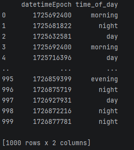

The column time_of_day is not constant; thus, it provides a pattern for the model to learn from. But text values such as "morning", "day", "night", etc. cannot be used by the model directly. Each text value must be converted to an integer. The text values "morning", "day", "evening", "night" in the time_of_day column will be replaced by values 0, 1, 2, 3, respectively. The time_of_day column can now be used by the model. This feature is also periodic. Periodic features are, in some cases, cyclically encoded (especially when using linear models or neural networks) since the minimum and maximum values of a periodic feature are next to each other (like a clock), but cyclical encoding typically results in worse model accuracy when used with decision trees. This is because cyclical encoding involves splitting the feature into two features, each representing the sine and cosine components of the original. The issue is that decision trees only split one feature at a time, but both components are needed simultaneously to get the x and y coordinates on the unit circle where the original feature value (time of day in this case) lies. With decision trees, it's best to leave the periodic data as is (or use label encoding if the data is textual), according to some sources.

Label encoding of time_of_day:

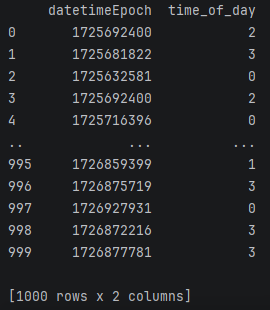

Also, the year data can be extracted from datetimeEpoch. Let's see whether these measurements were taken in the same year.

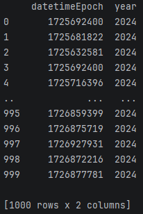

All measurements were taken in the same year, so the year column provides no information. The measurements were also taken within the same month, but on different days.

Here is the extracted day-of-month data:

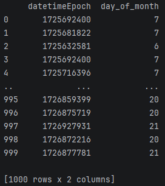

The day_of_month column is not constant, so it provides a pattern, but all data were collected within the same month. Without data from other months, it would be difficult to determine whether the feature day_of_month correlates with a periodic trend or a long-term one. This should be kept in mind when making predictions.

The feature datetimeEpoch can now be removed. All relevant information has been extracted from it.

There are three other periodic features: moonphase, dayOfWeek, and winddir (wind direction). They are not categorical, so label encoding is not needed (no cyclical encoding either); they will be left as is. There is a feature called month, but the value is constant, so it will be removed. Also, isWeekend, which is a categorical feature with values of true and false, will be label encoded.

Next, the correlation between every pair of features will be examined with a heat map. High pairwise correlations or collinearity between features is problematic because scores of feature importance can be split between the pair. This can make a feature seem less important than it truly is. Note, collinearity does not have much of an effect on the accuracy of decision tree based models, but must be addressed so that accurate scores of importance are returned. Collinearity can be addressed in multiple ways; these include removing one of the features, combining the features into one, using Principal Component Analysis (PCA), etc.

Here is a printout of the heat map. It's a bit large (the data set has many features), so the image will be separated into halves.

Left:

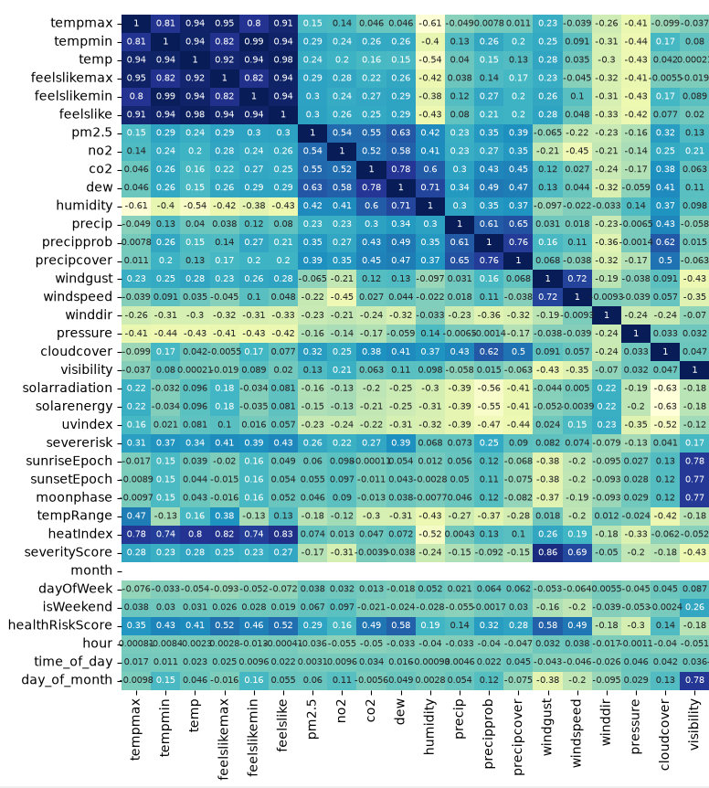

Looking at the dark-colored cluster in the upper left, six features correlate very highly with one another (all pairs have correlation coefficients greater than or equal to 0.8). The features are tempmax, tempmin, temp, feelslikemax, feelslikemin, and feelslike. Several rules will determine which feature/s to remove. One can keep the feature/s that correlate most highly with the target, keep the feature/s that are most intuitive to stakeholders, keep the feature that has the highest variance (features whose values do not vary much provide less of a pattern for a model to learn from and can be removed), etc. Looking at the cluster, subjective and objective measures of temperature correlate almost perfectly. For example, the feature feelslikemin correlates with tempmin at 0.99. Correlations between the other two subjective-objective pairs within the cluster are similar. The subjective measures of temperature correlate more strongly with the target feature (healthRiskScore), and the objective and subjective groups have similar variance, so the objective measures of temperature (tempmax, tempmin, temp) can be removed. Next, feelslikemin and feelslikemax can be removed, but before removal, the difference between them can be stored in a new feature (a large difference between the highest and lowest outdoor temperature on a given day is known to be related to health risk). A new feature, which is the difference between the two, called subjectiveTempDiff, will be created.

An alternative to the course of action above is to use Principal component analysis (PCA). This consists of using techniques from linear algebra to perform dimensionality reduction. This process would return a few uncorrelated components/features from the 6x6 cluster of highly correlated features. Having to deal with a few uncorrelated features instead of 6 sounds nicer, and most of the information from the original features will be preserved, but these features would be harder to interpret. Instead of feature names such as temp or feelslike showing up on a graph of importance, features such as pca_1 and pca_2 would be present, and what they represent would be hard to pinpoint.

In the lower left, sunriseEpoch, sunsetEpoch, datetimeEpoch, and moonphase are highly correlated (all at 0.99). The feature datetimeEpoch was removed earlier, so sunriseEpoch and datetimeEpoch, which are statistical proxies for datetimeEpoch, can also be removed. Before removing them, a new feature, which is the difference between them, can be created. This feature will be called durationOfSunlight. Also, feelslike and heatindex are correlated somewhat highly (0.83) and appear to be similar constructs. Both are calculated with a complex formula, but the difference between them is the inclusion of wind speed. Unlike Heat-Index, the equation for Feels-Like includes wind speed. Both can be kept for now due to the possibility of being dissimilar constructs.

The feature severityScore, which represents the severity of weather conditions, correlates very highly with windgust (0.86). Severe weather conditions usually include wind gusts, and high wind gusts alone (without rain, sleet, hail, etc.) are a criterion for severe weather. So, effectively, they may represent the same thing. Both features have similar correlations with the target variable, but windgust has lower variance, so it will be removed.

Right:

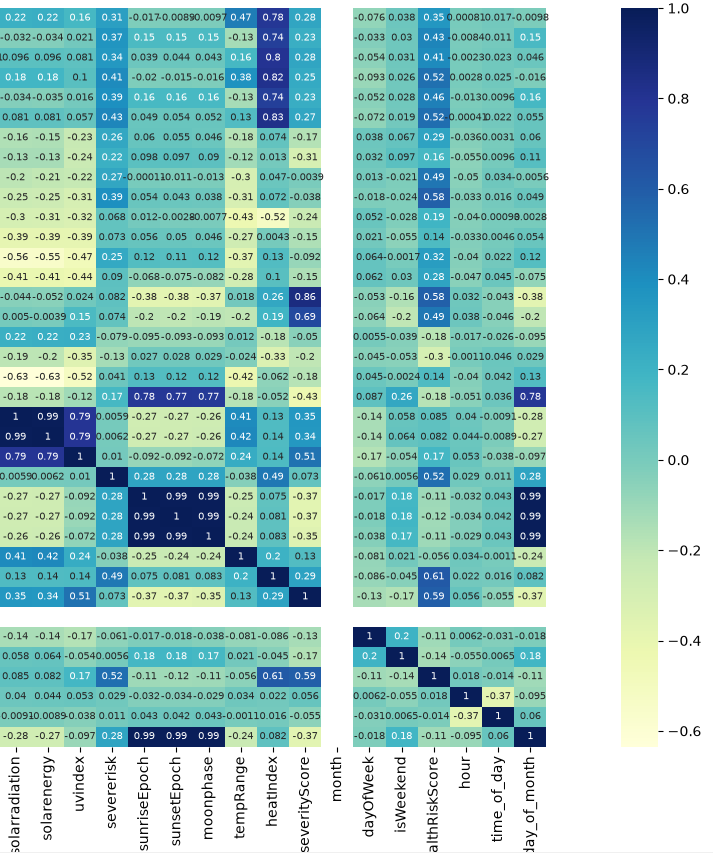

Looking at the right side of the heat map, sollarradiation and solarenergy are almost perfectly correlated. Both are similarly correlated with the target feature, but solarradiation has higher variance, so it will be kept. Earlier, day_of_month was extracted from datetimeEpoch. It correlates with moonphase at 0.99. Both correlate with the target at -0.11, but moonphase has higher variance, so day_of_month will be removed.

Heat map after deletions:

Left:

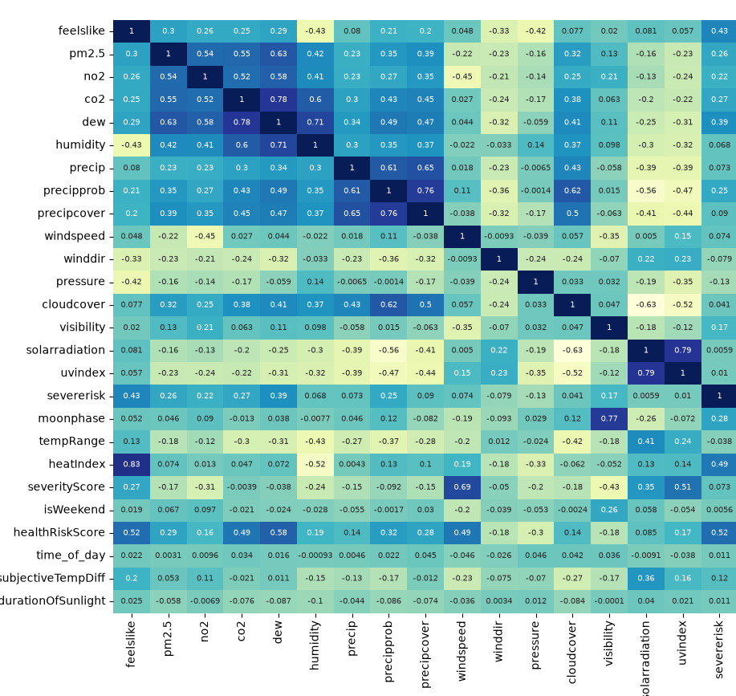

Right:

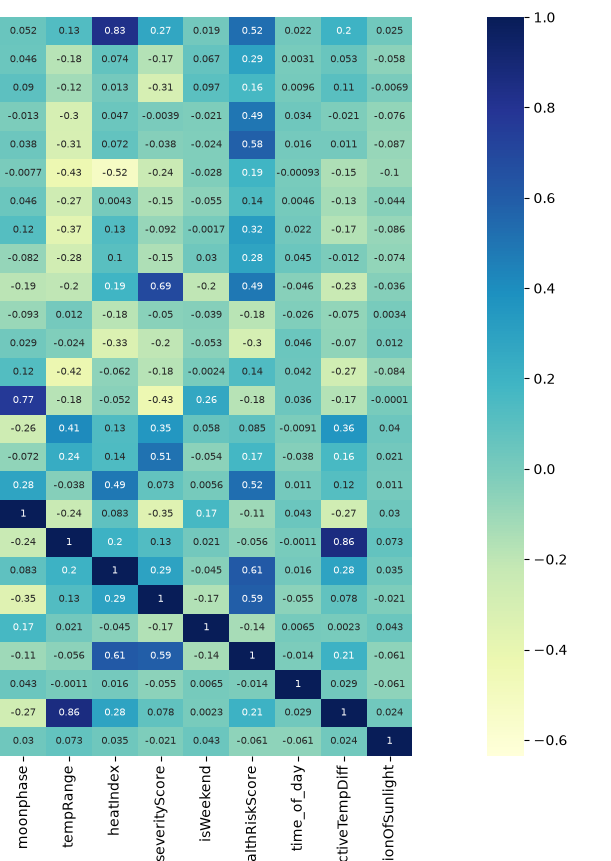

Looking at the updated heat map, high pairwise correlations (above 0.8) have been reduced substantially, but one was missed. A new variable was created called subjectiveTempDiff by finding the difference between the variables feelslikemax and feelslikemin, but a variable named tempRange was overlooked. This variable and subjectiveTempDiff correlate very highly and may measure the same thing; therefore, one of them should be removed. The feature subjectiveTempDiff correlates more highly with the target, and its variance is similar to that of tempRange, so tempRange will be removed.

In addition to collinearity, multicollinearity can exist. Within a set of features, high pairwise correlations may not be present, but a feature can correlate highly with a combination of the others. For example, all pairs within the group f1, f2, f3, f4, f5 can have low correlations with one another, but if f1 = f2 + f3 + f4 + f5, then a high correlation, or in this case, multicollinearity, exists, and feature importance can be split between the group.

To check for multicollinearity, VIF (Variance Inflation Factor) is used. Here's how it works: During each iteration of VIF, one feature acts as the dependent variable, and the others act as the independent variables. Linear regression is then performed, and an R^2 value is computed for the feature that is currently acting as the dependent variable. For a group of n features, this process will occur n times. For each feature, the equation VIF_i = 1/(1-R_i^2) gives the VIF value for the ith feature. Values greater than 5 or 10 may indicate high multicollinearity.

VIF printout:

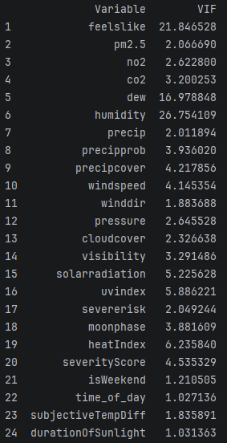

There are 6 features whose VIF values surpass the threshold of 5. These values are possibly the result of high pairwise correlations that have not been rectified. The pairs feelslike and heatIndex, uvindex and solarradiation, and humidity and dew still correlate highly with each other. The pairs are still present because either the members of a given pair were thought to be dissimilar constructs, or the correlational threshold of 0.8 was not met. Removing a feature from each pair should reduce the VIF value of the remaining feature of each pair.

The feature heatIndex stands out with a VIF value above 5. Earlier, a decision was made not to remove either heatIndex or feelslike, due to information suggesting that they may have been dissimilar constructs. Still, heatIndex's VIF value, which is above 5, suggests that it can cause issues associated with multicollinearity if not removed; therefore, it will be removed, and its proxy, feelslike, will be kept.

Features dew and humidity are highly correlated at 0.71, but are not the same thing. The feature humidity is the relative humidity, which is the amount of water vapor currently present in the air relative to the amount that the air is capable of holding at the current temperature. The feature dew is the dew point. The dew point is the temperature at which water vapor will condense into water droplets. If absolute humidity is higher, then the water vapor will condense into water droplets at a higher temperature. Dew point is more closely related to absolute humidity than relative humidity, and the feature in this data set that represents it has higher variance and correlates more highly with the target variable, so the feature humidity, which represents relative humidity, will be removed.

Features solarradiation and uvindex also have VIF values above 5. They are highly correlated at 0.79, but did not grab attention because the threshold of 0.8 was not met. Both features have similar variance, but uvindex correlates more highly with the target, so it will be kept.

Updated VIF values:

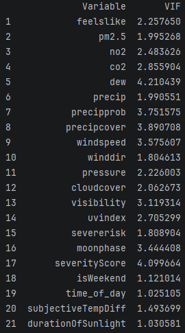

All values are now under 5; therefore, multicollinearity has been reduced to an acceptable level (there are still two features with VIF values of roughly 4, but these will be left alone since the threshold of 5 isn't met).

Model:

Before deriving values of feature importance, a model has to be created. Gradient Boosted Regression will be used.

First, the data will be divided into a test and train set using an 80/20 split.

Next, 5-fold cross-validation and hyperparameter tuning will be performed on the training set. 5-fold cross-validation in this case will consist of splitting the training set into 5 equally sized subsets. During each of the 5 cycles of cross-validation, 4 of the 5 subsets will be combined to act as the training set, the remaining subset will act as the test set.  Also, Hyperparameter tuning will be implemented to find the combination of hyperparameters that yields the highest accuracy for that cycle. Essentially, each of the 5 subsets will act as a test set at some point in time during the process. This is superior to a simple train-test split because high accuracy can be achieved on one test set by chance. But if there are multiple test sets and accuracy is high on all, then the model is probably one that will generalize well to new data.

List of hyperparameters:

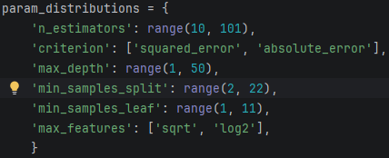

These will be tuned using randomizedSearchCV(), which selects random values within a range to use. This is computationally less expensive than trying every value within a range and still yields good accuracy.

Results of 5-fold cross-validation:

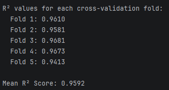

Model accuracy (test set):

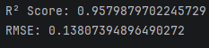

Results/Feature Importance (SHAP):

Rank of importance (Bar plot):

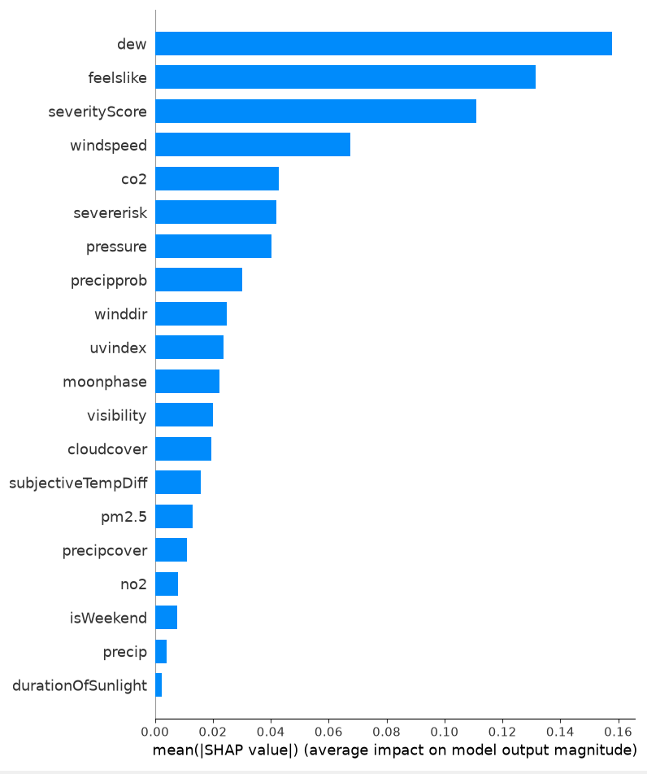

For each feature on the plot above, the corresponding value is found by taking the absolute value of every SHAP value of the feature (from each data point) and computing the average.

Rank of Importance (Summary plot):

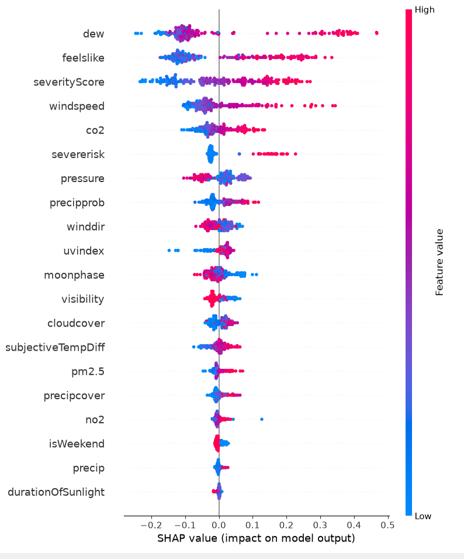

The summary plot gives a localized and global view of importance.

Overall/global feature importance is conveyed on the vertical axis, with order of importance increasing from bottom to top (less important features are placed lower). Also, each dot represents the SHAP value for a particular data point and feature name. The color of the dot represents the feature's value at the data point, with red representing higher values and blue lower.

Looking at both plots, the hierarchy of importance is close to what one would expect. The most important feature, or the one that is most closely related to health risk, is dew. The feature dew is the dew point, which is the temperature at which air is completely saturated with water vapor (note that, at higher temperatures, air can hold more water vapor). If the temperature is any lower than this, water vapor will condense into dew, fog, clouds, etc. Dew point is very closely related to humidity. Higher humidity, higher dew point (if humidity is high, the temperature does not have to drop as much for water droplets to form vs. if humidity is low). High humidity is related to health risk in quite a few ways. It exacerbates respiratory problems, blocks sweat, strains the heart, keeps air pollution closer to the ground, etc. Next is feelslike, which is the temperature calculated by either of two equations (wind-chill or heat-index) depending on the temperature. The values of feelslike at cooler temperatures are calculated with the equation for wind chill, which is a function of wind speed and air temp. At higher temperatures, feelslike is calculated by the equation for heat index, which is a function of air temp and relative humidity. Health risk increases as feelslike increases, which makes sense. The dangers of extreme heat are well known (heatstroke, dehydration, etc.). Features severityScore and windspeed follow. The features severityScore (represents the severity of weather conditions) and windspeed are closely related. Severe storms are typically accompanied by high winds. Needless to say, these can result in injury or, worse, loss of life. Note: predictions are driven upward by each of the first four features (higher feature values correspond to higher SHAP values). The trend is opposite for features such as pressure and visibility (higher feature values correspond to lower SHAP values). For visibility, this makes sense. If visibility is high, such as with the absence of fog, then car accidents are less likely to occur.

Reflection/Improvements:

1. The time of day was extracted from the feature datetimeEpoch, and a new feature called time_of_day was created. Originally, this feature was one-hot encoded, but the fact that the feature was periodic was overlooked initially. It was decided to undo the one-hot encoding and return the feature to its initial state (according to some sources, periodic features should be left in the original state when used with decision trees). The model's accuracy was slightly higher with one-hot encoding than with leaving the feature in its original state. Also, Cyclical encoding was considered, but was not implemented because it is a bad choice both theoretically and in practice. Still, Cyclical encoding should have been implemented to see what effect it would have on the model's accuracy. In some cases, it can work well with a particular dataset.
2. Also, the removal of features to address collinearity/multicollinearity can be automated with the Python library called collinearity. This will be considered for future projects.
3. At times, it was concluded that some feature pairs had similar variance. This was concluded because the values of variance were close together numerically (for example, 2.068 vs 2.1). This may have been erroneous. A test called the F-test can be used to determine whether the difference in variance between features is significant. For this test to be used, the features must follow a normal distribution. If the features are not normal, Levene's test is used. A similar mistake was made with correlation coefficients.
